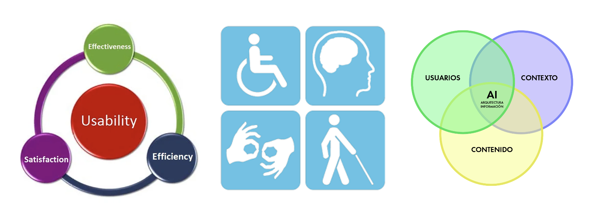
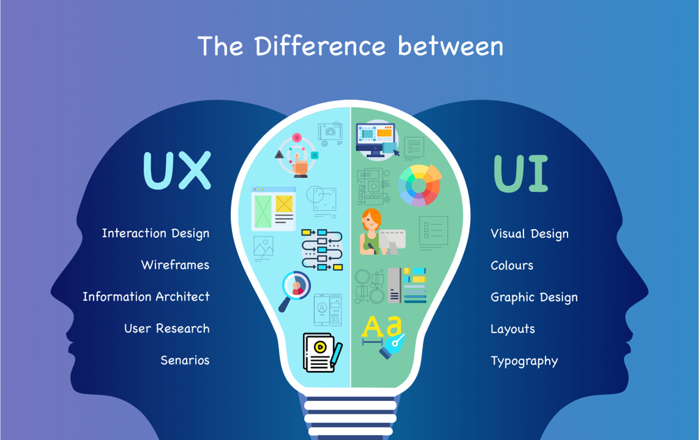
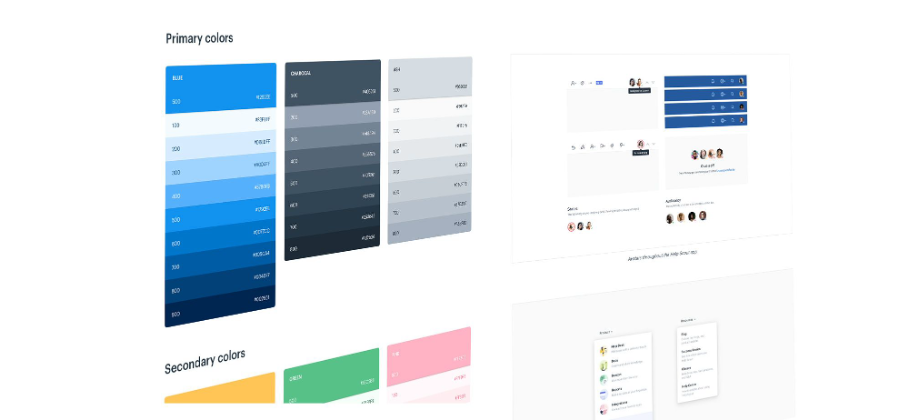

# **U1 - Herramientas para diseño de interfaces web**

**Debate inicial**

- ¿Qué es una interfaz de usuario?
- ¿Dónde podemos encontrar interfaces de usuario?
- ¿En quién tenemos que pensar cuando creamos una interfaz de usuario?
- ¿Qué herramientas conoces para el diseño y programación de interfaces?
- ¿Qué lenguajes conoces para definir interfaces de usuario?
- ¿Qué es UI - UX?

## 1. **Interfaz de usuario (UI)**

- Es el punto de interacción y comunicación humano-computadora en un dispositivo. 
- Esto puede incluir pantallas de visualización, teclados, un mouse y la apariencia de un escritorio.  
- No está limitado a aplicaciones informáticas. Una lavadora, un automóvil o un mando a distancia también son interfaces de usuario. 

Fuente: [Computer Weekly](https://www.computerweekly.com/es/definicion/Interfaz-de-usuario-UI)

**Ejemplos de interfaz de usuario**

- mouse de computadora
- control remoto
- realidad virtual
- cajeros automáticos (ATM)
- velocímetro
- pantalla táctil 
- lavavajillas
- automóvil

### 1.1 **Tipos de interfaz de usuario**

Tipos de interfaz según la forma de interactuar del usuario

- [CLI](https://es.wikipedia.org/wiki/Interfaz_de_l%C3%ADnea_de_comandos) (Command-Line Interface): interfaz de línea de commandos. Sólo representan texto. El teclado es el periférico preferido. 
- [GUI](https://es.wikipedia.org/wiki/Interfaz_gr%C3%A1fica_de_usuario) (Graphic User Interface): Permiten comunicarse con la computadora de forma rápida e intuitiva representando gráficamente los elementos de control y medida. El ratón (y el teclado) es el dispositivo periférico preferido. 
- [NUI](https://es.wikipedia.org/wiki/Interfaz_natural_de_usuario) (Natural User Interface): Pueden ser táctiles, representando gráficamente un «panel de control» o mediante reconocimiento del habla. 

Fuente: [Wikipedia](https://es.wikipedia.org/wiki/Interfaz_natural_de_usuario)

## 2. **Experiencia de usuario (UX)**

> _“La función de los profesionales de la experiencia de usuario no es otra que hacer esta tecnología amigable, satisfactoria, fácil de usar y, por tanto, realmente útil”_
> 
> [Experiencia de usuario: Principios y métodos, Yusef Hassan Montero](https://yusef.es/Experiencia_de_Usuario.pdf)

**UX (User Experience)**

- **UX es la manera en que el usuario percibe, siente o interactúa con un sistema o un servicio**. Se trata de la sensación del usuario cuando está en contacto e interactúa con una web, una app o un sistema
- **UX es un grupo de disciplinas**: interacción, arquitectura de la información, animación en diseño, estilo de comunicación
- **UX es un proceso**. No se trata de algo estático; un buen desarrollo de UX involucra una serie de fases para garantizar la calidad de un producto

Fuente: [Strike Heredia - Domestika](https://www.domestika.org/es/blog/2125-que-es-ux)

### 2.1 **Conceptos fundamentales**

- **Usabilidad**: es un atributo de calidad de un producto que se refiere sencillamente a su facilidad de uso.

- **Accesibilidad**: que se refiere a la posibilidad de que pueda ser usado sin problemas por el mayor número de personas posibles, independientemente de las limitaciones propias del individuo o de las derivadas del contexto de uso.

- **Arquitectura de información**: “El arte, la ciencia y la práctica de diseñar espacios interactivos comprensibles, que ofrezcan una experiencia de uso satisfactoria facilitando el encuentro entre las necesidades de los usuarios y los contenidos y/o funcionalidades del producto”

Fuente: [Experiencia de usuario: Principios y métodos, Yusef Hassan Montero](https://yusef.es/Experiencia_de_Usuario.pdf)

### 2.2 **Diseño centrado en el usuario**

El Diseño Centrado en el Usuario o DCU (UCD, User-Centered Design) hace
referencia a una visión o filosofía del diseño en la que el proceso está
conducido por información acerca de la audiencia objetiva del producto.

La principal diferencia del DCU frente a otros enfoques es que su proceso
no es secuencial o lineal, sino que presenta ciclos en los que
iterativamente se prueba el diseño y se optimiza hasta alcanzar el nivel de
calidad requerido.

Fuente: [Experiencia de usuario: Principios y métodos, Yusef Hassan Montero](https://yusef.es/Experiencia_de_Usuario.pdf)

**Metodología Agile**

- El manifiesto Agile: [agilealliance.org](https://www.agilealliance.org/agile101/the-agile-manifesto/)
- SCRUM: [Wikipedia.org](https://es.wikipedia.org/wiki/Scrum_(desarrollo_de_software))

### 2.3 **Principios del diseño**

- Clasificación
- Color
- Eficiencia
- Error humano
- Estética
- Fotografías
- Iconos
- Inteligencia colectiva
- Jerarquía visual
- Legibilidad e inteligibilidad
- Ley de Fitts
- Mapeo Natural
- Ordenación
- Relevancia
- Taxonomías
- Toma de decisions
- Visibilidad y retroalimentación

Para más información consultar: [Experiencia de usuario: Principios y métodos, Yusef Hassan Montero](https://yusef.es/Experiencia_de_Usuario.pdf)

### 2.4 **Métodos para el UX**

- Analítica Web
- Card Sorting
- Diagramas de interacción
- Diseño modular
- Encuestas y entrevistas
- Evaluación eurística
- Personajes y escenarios.
- Pruebas A/B
- Pruebas con usuarios
- ROI
- Wireframes

Para más información consultar: [Experiencia de usuario: Principios y métodos, Yusef Hassan Montero](https://yusef.es/Experiencia_de_Usuario.pdf)

**UI versus UX**

## 3. **Sistemas de Diseño**

Un **sistema de diseño** es un conjunto de **principios, componentes, guías y herramientas** que permiten mantener la coherencia y escalabilidad en el desarrollo de productos digitales (aplicaciones, sitios web, etc.). 

Se enfoca tanto en el diseño visual como en la experiencia del usuario y el código. 

 Su objetivo es facilitar la **colaboración entre diseñadores y desarrolladores**, al tiempo que garantiza la consistencia en todo el producto.

Fuente: [designerup.co](https://designerup.co/blog/10-best-design-systems-and-how-to-learn-and-steal-from-them/)

